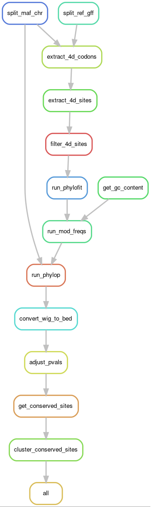

```{r setup, warning=FALSE, message=FALSE}

knitr::opts_chunk$set(echo = TRUE, warning = FALSE, message = FALSE)

library(tidyverse)
library(data.table)
# Data manipulation

library(cowplot)
library(gridExtra)
library(ggridges)
library(ggplotify)
# Plotting

library(dbscan)
library(mlbench)
# Clustering/statistics

library(kableExtra)
library(RColorBrewer)
library(viridis)
library(dendextend)
source(here("docs", "lib", "design.r"))
# Design

library(ggtree)
source(here("docs", "lib", "get_tree_info.r"))
# Phylogenetics

library(here)
library(knitr)
# File management

```

# Predicting conserved elements

For PhyloAcc, or for figuring out if conserved elements actually exist.

<p align="center">
  
</p>

## Zoonomia alignment

241 mammalian species in MAF.

```{r zoonomia-tree, warning=FALSE, message=FALSE, fig.align='center', fig.height=8, fig.width=8}

# Function to update monophyletic clades
update_clades_to_Y = function(tree, echolocates_df) {
    is_monophyletic_Y <- function(node) {
        # Get all descendants of the current node
        descendant_tips = getDescendants(tree, node)
        # Remove internal nodes, get only terminal tips
        descendant_tips = descendant_tips[descendant_tips <= length(tree$tip.label)]
        # Check if all these descendants are "Y"
        all_Y = all(echolocates_df$echolocates[descendant_tips] == "Y")
        return(all_Y)
    }
    
    # Loop through all nodes and update their labels
    for (i in seq_len(nrow(echolocates_df))) {
        node = echolocates_df$node[i]
        if (node > length(tree$tip.label)) {  # Interior nodes only
            if (is_monophyletic_Y(node)) {
                echolocates_df$echolocates[i] = "Y"
            }
        }
    }
    
    return(echolocates_df)
}


tree_info_file = here("summary-data", "241-mammalina-2020v2b-tree-info.csv")
zoonomia_info = read.csv(tree_info_file) %>%
  mutate(label = str_replace_all(Species, " ", "_"))

tree_file = here("summary-data", "241-mammalian-2020v2.phast-242.nh")
zoonomia_tree = read.tree(tree_file)
#zoonomia_tree_df = treeToDF(zoonomia_tree)
zoonomia_tree_df = zoonomia_tree %>% as_data_frame(row.names = NULL)

# Perform left join and transform echolocates to "Y" or "N"
zoonomia_tree_info = left_join(zoonomia_tree_df, zoonomia_info, by = "label") %>%
  mutate(echolocates = ifelse(is.na(echolocates) | echolocates == "", "N", "Y"))

# Update ancestral nodes for echolocating clades
zoonomia_tree_info = update_clades_to_Y(zoonomia_tree, zoonomia_tree_info)

tree_p = ggtree(zoonomia_tree, layout="circular", branch.length="none") %<+% zoonomia_tree_info + 
  geom_tree(aes(color=echolocates)) +
  geom_tiplab(aes(label = label), size = 2) +
  scale_color_manual(values = corecol(numcol=2, pal="wilke")) +
  theme_tree()
  
tree_p

```

# Conserved sites with phyloP

```{r sread-cons-site-counts, warning=FALSE, message=FALSE}

knit_exit()
# Define the directory containing the .bed files
directory = here("summary-data", "all-chromosomes")

# List all .bed files in the directory
conserved_sites_files = list.files(directory, pattern = "\\.conserved-site-counts.0.05.tsv$", full.names = TRUE)

# Initialize an empty data.frame or tibble
conserved_site_counts = tibble()

# Loop through each file and read the data
for (file in conserved_sites_files) {
  # Read the file
  temp_df = read_delim(file, delim=" ", col_names = c("chromosome", "total.conserved"))
  
  # Add the data to the combined data.frame
  conserved_site_counts = bind_rows(conserved_site_counts, temp_df)
}

# Print the combined data.frame or tibble
print(conserved_site_counts)

chromes_file = here("summary-data", "GRCh38.chromes")
chromes_df = read_tsv(chromes_file, col_names = c("chromosome", "chromosome.length", "bytes", "ll1", "ll2")) %>%
  select(chromosome, chromosome.length)

# Join the combined_df with chromes_df
conserved_site_counts = conserved_site_counts %>%
  left_join(chromes_df, by = "chromosome") #

conserved_site_counts = conserved_site_counts %>%
  mutate(percent.conserved = total.conserved / chromosome.length)

# Print the final data.frame or tibble
print(conserved_site_counts)

```

# Predicting conserved elements based on clusters of conserved sites predicted with phyloP using the HDBSCAN cluster algorithm

## Examples

### 1D data (akin to genome positions)

```{r hdbscan-example-1d, warning=FALSE, message=FALSE}

# Generate synthetic 1D data
set.seed(42)
x = sort(runif(100, 0, 10))
x[25:30] = x[25:30] + 5  # Create a denser cluster by adding a constant shift
x[70:75] = x[70:75] + 2  # Create another dense cluster with a smaller shift

# Convert to a tibble using tidyverse
df_linear = tibble(x = x, y = rep(0, length(x)))  # A secondary y dimension for visualization

# Convert data frame to numeric matrix for hdbscan
linear_matrix = df_linear %>% select(x) %>% as.matrix()

# Define different minPts values to test
minPts_values = c(3, 5, 10, 15, 20)

# Initialize a list to hold plots
data_plots = list()
tree_plots = list()

# Function to find cluster boundaries
find_cluster_boundaries = function(df) {
  df %>%
    filter(cluster != "0") %>%
    group_by(cluster) %>%
    summarize(left = min(x), right = max(x))
}

# Iterate over the minPts values
for (minPts in minPts_values) {
  # Perform HDBSCAN clustering
  hdbscan_result = hdbscan(linear_matrix, minPts = minPts)
  
  # Add cluster labels to data frame and shape assignment
  df_linear = df_linear %>%
    mutate(cluster = factor(hdbscan_result$cluster),
           type = if_else(cluster == "0", "Noise", "Cluster"))
  
  # Create a dynamic color palette excluding noise
  unique_clusters = df_linear %>% distinct(cluster) %>% filter(cluster != "0") %>% pull(cluster)
  cluster_colors = viridis(length(unique_clusters), option = "D")
  names(cluster_colors) = unique_clusters
  
  # Identify cluster boundaries
  cluster_boundaries = find_cluster_boundaries(df_linear)
  
  # Construct plot
  p_data = ggplot(df_linear, aes(x = x, y = y)) +
    geom_rect(data = cluster_boundaries, aes(xmin = left, xmax = right, ymin = -0.025, ymax = 0.025, fill = as.factor(cluster)), color="black", alpha = 0.2, inherit.aes = FALSE, show.legend = FALSE) +
    geom_point(aes(color = cluster, shape = type), size = 3) +
    scale_color_manual(values = cluster_colors) +
    scale_fill_manual(values = cluster_colors, guide = "none") +  # Ensure fill guide is not shown
    scale_shape_manual(values = c("Noise" = 8, "Cluster" = 16)) +
    ylim(-0.2, 0.2) +  # Explicitly set y-axis limits
    theme_minimal() +
    labs(title = paste("HDBSCAN Clustering with minPts =", minPts), color = "Cluster", shape = "Type") +
    guides(shape = guide_legend(override.aes = list(color = "black")), color = guide_legend(order = 2))
  
  
  # Store the data plot
  data_plots[[as.character(minPts)]] <- p_data 
  print(p_data)
  
  # Plot the condensed tree and color branches by cluster
  dendro = as.dendrogram(hdbscan_result$hc)
  dendro = color_branches(dendro, k = length(unique_clusters) + 1, col = cluster_colors) 
  
  # Display each dendrogram individually in the loop
  #plot(dendro, main = paste("Condensed Tree with minPts =", minPts), hang = -1)
  
  tree_grob = as.grob(function() plot(dendro, main = paste("Condensed Tree with minPts =", minPts)))
  tree_plots[[as.character(minPts)]] <- tree_grob
}

# Arrange and display all plots in a grid
# grid.arrange(
#   arrangeGrob(
#     do.call(gridExtra::arrangeGrob, c(lapply(data_plots, eval), ncol = 1)),
#     do.call(gridExtra::arrangeGrob, c(tree_plots, ncol = 1)),
#     ncol = 2
#   )
# )

```

### 2D data (for fun)

```{r hdbscan-example-2d, warning=FALSE, message=FALSE}

# Generate synthetic spiral data
set.seed(42)
spiral_data = mlbench.spirals(300, cycles = 1, sd = 0.05)

# Convert to a tibble using tidyverse
df_spiral = as_tibble(spiral_data$x)
colnames(df_spiral) <- c("x", "y")

# Convert data frame to numeric matrix for hdbscan
spiral_matrix = df_spiral %>% select(x, y) %>% as.matrix()

# Define different minPts values to test
minPts_values = c(3, 5, 10, 15, 20)

# Initialize a list to hold plots
plots = list()

# Iterate over the minPts values
for (minPts in minPts_values) {
  # Perform HDBSCAN clustering
  hdbscan_result = hdbscan(spiral_matrix, minPts = minPts)
  
  # Add cluster labels and type (noise vs cluster) to the data frame
  df_spiral = df_spiral %>%
    mutate(cluster = factor(hdbscan_result$cluster),
           type = if_else(cluster == "0", "Noise", "Cluster"))
  
  # Generate color palette excluding noise and map to clusters
  unique_clusters = df_spiral %>% filter(cluster != "0") %>% distinct(cluster) %>% pull(cluster)
  cluster_colors = viridis(length(unique_clusters), option = "D")
  names(cluster_colors) = unique_clusters
  
  # Generate the plot for this minPts
  p = ggplot(df_spiral, aes(x = x, y = y)) +
    geom_point(data = filter(df_spiral, cluster == "0"), aes(shape = type), color = "grey", size = 3, show.legend = TRUE) +
    geom_point(data = filter(df_spiral, cluster != "0"), aes(color = cluster, shape = type), size = 3, show.legend = TRUE) +
    scale_color_manual(values = cluster_colors) +
    scale_shape_manual(values = c("Noise" = 8, "Cluster" = 16)) +
    theme_minimal() +
    labs(title = paste("HDBSCAN Clustering with minPts =", minPts), color = "Cluster", shape = "Type") +
    guides(shape = guide_legend(override.aes = list(color = "black"), order = 1), color = guide_legend(order = 2))
  
  plots[[as.character(minPts)]] = p
  print(p)
}

# Arrange and display all plots in a grid
#grid.arrange(grobs = plots, ncol = 1)

```
```{r read-cons-clusters, warning=FALSE, message=FALSE}

# Define the directory containing the .bed files
directory = here("data", "01b-zoonomia-aln", "04-phylop", "clustering", "all-chromosomes")

# List all .bed files in the directory
bed_files = list.files(directory, pattern = "\\.bed$", full.names = TRUE)

# Initialize an empty data frame to store the combined data
conserved_clusters <- tibble()

# Loop through each file, read the data, extract information from the file name, and append it to the combined data frame
for (file_path in bed_files) {
  # Extract file name without extension
  file_name = basename(file_path)
  file_name = tools::file_path_sans_ext(file_name)
  #print(file_name)
  
  # Extract information from the file name (assuming the format is consistent)
  
  info = str_split(file_name, "-")
  min_cluster_size = info[[1]][5]
  min_samples = info[[1]][6]
  
  # Read the .bed file into a data frame
  df <- read_tsv(file_path, col_names = c("chromosome", "start", "end", "cluster.id", "num.conserved"), col_types = cols(
      chromosome = col_character(),
      start = col_integer(),
      end = col_integer(),
      cluster_id = col_character()
    ))
  
  # Add the extracted information as new columns
  df = df %>%
    mutate(min.cluster.size = min_cluster_size, min.samples = min_samples) %>%
    mutate(chromosome = paste0("chr", chromosome))
  
  # Append the data frame to the combined data frame
  conserved_clusters = bind_rows(conserved_clusters, df)
}

```

```{r summarize, warning=FALSE, message=FALSE}

total_sites = sum(conserved_site_counts$chromosome.length)
total_conserved_sites = sum(conserved_site_counts$total.conserved)
perc_conserved_sites = total_conserved_sites / total_sites

conserved_clusters = conserved_clusters %>%
  mutate(cluster.length = end - start, 
         perc.cons.sites = num.conserved / cluster.length)

conserved_clusters_summary = conserved_clusters %>%
  left_join(conserved_site_counts, by = "chromosome") %>%
  group_by(min.cluster.size, min.samples) %>%
  summarize(num.clusters = n(),
            total.conserved.cluster.len = sum(cluster.length),
            mean.cluster.length = mean(cluster.length),
            med.cluster.length = median(cluster.length),
            cons.sites.in.clusters = sum(num.conserved),
            mean.cons.sites.in.clusters = mean(num.conserved),
            median.cons.sites.in.clusters = median(num.conserved),
            mean.perc.cons.sites.in.clusters = mean(perc.cons.sites),
            median.perc.cons.sites.in.clusters = median(perc.cons.sites)) %>%
  mutate(total.sites = total_sites,
         total.conserved.sites = total_conserved_sites,
         perc.conserved.sites = perc_conserved_sites,
         perc.conserved.sites.in.clusters = cons.sites.in.clusters / total.conserved.sites)


# conserved_elements_chr_summary = conserved_elements %>% 
#   left_join(conserved_site_counts, by = "chromosome") %>%
#   mutate(cluster.length = end - start) %>%
#   group_by(chromosome, chromosome.length, total.conserved, percent.conserved, min.cluster.size, min.samples) %>%
#   summarize(num.clusters = n(), 
#             mean.cluster.length = mean(cluster.length), 
#             med.cluster.length = median(cluster.length), 
#             cons.sites.in.clusters = sum(num.conserved)) %>%
#   #left_join(conserved_site_counts, by = "chromosome") %>%
#   mutate(percent.cons.in.clusters = cons.sites.in.clusters / total.conserved)


```


```{r plot, warning=FALSE, message=FALSE}

ggplot(conserved_clusters_summary, aes(min.samples, num.clusters, color = min.cluster.size, group=min.cluster.size)) +
  geom_point(size=2, alpha=0.6) +
  geom_line() +
  labs(x = "min_samples", y = "# clusters", color = "min_cluster_size") +
  scale_color_manual(values=corecol(pal="wilke", numcol=3)) +
  bartheme() +
  theme(legend.title = element_text(size=10),
        legend.position="bottom")


ggplot(conserved_clusters_summary, aes(min.samples, med.cluster.length, color = min.cluster.size, group=min.cluster.size)) +
  geom_point(size=2, alpha=0.6, fill="transparent") +
  geom_line(aes(linetype = "Median")) +
  geom_point(aes(y=mean.cluster.length), size=2, alpha=0.6) +
  geom_line(aes(y=mean.cluster.length, linetype="Mean")) +
  scale_color_manual(values=corecol(pal="wilke", numcol=3)) +
  scale_linetype_manual(values = c("Median" = "solid", "Mean" = "dashed")) +
  labs(x = "min_samples", y = "Cluster length", color = "min_cluster_size") +
  bartheme() +
  theme(legend.title = element_text(size=10),
        legend.position="bottom",
        legend.box = "vertical")
  #guides(color = guide_legend(nrow = 2), linetype = guide_legend(nrow = 2))

ggplot(conserved_clusters_summary, aes(x=min.samples, y=as.character(signif(perc.conserved.sites.in.clusters, 2)), fill=median.perc.cons.sites.in.clusters)) +
  geom_tile() +
  facet_wrap(~min.cluster.size) +
  scale_fill_gradient(low = "white", high = "red") +
  labs(x = "min_samples", y = "% conserved sites in clusters", fill = "Median % of cluster sites that are conserved") +
  bartheme() +
  theme(legend.position="bottom")
         
ggplot(conserved_clusters_summary, aes(x=perc.conserved.sites.in.clusters, y=median.perc.cons.sites.in.clusters)) +
  geom_point() +
  geom_line() +
  bartheme()

example_params = conserved_clusters %>% filter(min.samples==25, min.cluster.size==20)
ggplot(example_params, aes(x=perc.cons.sites)) +
  geom_histogram() +

  bartheme()


```


```{r read-cons-sites, warning=FALSE, message=FALSE}

# Define the directory containing the .bed files
directory = here("data", "01b-zoonomia-aln", "04-phylop", "all-chromosomes")

# List all .bed files in the directory
conserved_sites_files = list.files(directory, pattern = "\\.conserved.bed", full.names = TRUE)

# Initialize an empty data.frame or tibble
conserved_sites = tibble()

# Loop through each file and read the data
for (file in conserved_sites_files) {
  # Read the file
  temp_df = read_tsv(file, col_names = c("chromosome", "start", "end", "state.endcoding"))
  
  # Add the data to the combined data.frame
  conserved_sites = bind_rows(conserved_sites, temp_df)
}


```


```{r cons-site-dists, message=FALSE, warning=FALSE}


# Function to perform simulations and chi-square test for each chromosome
process_chromosome <- function(chrom, conserved_sites, chromes_df, bin_width) {
  # Filter data for the current chromosome
  chromosome_sites <- conserved_sites %>% filter(chromosome == chrom)
  chromosome_length <- chromes_df %>% filter(chromosome == chrom) %>% pull(chromosome.length)
  
  # Calculate number of bins based on chromosome length and bin width
  num_bins <- ceiling(chromosome_length / bin_width)
  
  # Bin data
  binned_data <- chromosome_sites %>%
    mutate(bin = floor((start / bin_width)) + 1) %>%  # Use bin width for calculation
    count(bin, name = "n") %>%
    complete(bin = seq_len(num_bins), fill = list(n = 0)) %>%
    mutate(chrom = chrom)  # Preserve `chrom` information

  # Chi-square test
  chi_sq <- chisq.test(binned_data$n, p = rep(1/num_bins, num_bins))
  
  list(
    binned_data = binned_data,
    chi_sq_result = chi_sq
  )
}

# Set desired bin width in base pairs
bin_width <- 10000

# Directly set chromosome order as desired
chromosomes <- c(paste0("chr", 1:22), "chrX")

# Initialize an empty data frame to collect binned data
binned_data_all_df <- data.frame()

# Use a for loop to process each chromosome
chi_sq_results <- list()  # Store Chi-square results

for (chrom in chromosomes) {
  cat("Processing:", chrom, "\n")
  result <- process_chromosome(chrom, conserved_sites, chromes_df, bin_width)
  
  # Append binned data
  binned_data_all_df <- bind_rows(binned_data_all_df, result$binned_data)
  
  # Collect Chi-square results
  chi_sq_results[[chrom]] <- result$chi_sq_result
}

# Convert chromosome column to a factor with specific levels for correct plotting
binned_data_all_df <- binned_data_all_df %>%
  mutate(chrom = factor(chrom, levels = chromosomes))

# Print chi-squared test results
for (chrom in chromosomes) {
  cat("Chi-squared test result for", chrom, ":\n")
  print(chi_sq_results[[chrom]])
  cat("\n")
}

# Plot with the correct chromosome ordering
p = ggplot(binned_data_all_df, aes(x = bin, y = n, fill = chrom)) +
  geom_bar(stat = "identity", alpha = 0.6) +
  facet_wrap(~ chrom, scales = "free_x") +
  theme_minimal() +
  labs(title = "Binned Conserved Sites Across Chromosomes",
       x = "Bin",
       y = "Frequency") +
  scale_fill_viridis_d()
print(p)
```

```{r inter-site-dists, message=FALSE, warning=FALSE}


# Assuming conserved_sites is a data.frame with 'chromosome' and 'start' columns
setDT(conserved_sites)  # Convert to data.table for faster operations

# Calculate inter-site distances within each chromosome
inter_site_distances <- conserved_sites[order(chromosome, start), 
                                        .(inter_dist = diff(start)), 
                                        by = chromosome]

# Add a small number to avoid log(0) in plotting if needed for density comparisons
inter_site_distances[, inter_dist := ifelse(inter_dist == 0, NA, inter_dist)]

# Convert chromosome column to a factor with specific levels for correct plotting
inter_site_distances <- inter_site_distances %>%
  mutate(chromosome = factor(chromosome, levels = chromosomes))

# Log-transform the data for visualization
inter_site_distances[, log_inter_dist := log10(inter_dist)]

# Density plot on log scale
ggplot(inter_site_distances, aes(x = log_inter_dist)) +
  geom_density(fill = "blue", alpha = 0.7) +
  facet_wrap(~ chromosome, scales = "free_x") +
  theme_minimal() +
  labs(title = "Inter-site Distance Distribution (Log10)",
       x = "Log10 of Inter-site Distance (bp)",
       y = "Density")

# Ridgeline plot for better group representation
ggplot(inter_site_distances, aes(x = log_inter_dist, y = chromosome, fill = chromosome)) +
  geom_density_ridges(alpha = 0.8, scale = 0.9) +
  theme_minimal() +
  labs(title = "Ridgeline Plot of Log-Transformed Inter-site Distances",
       x = "Log10 of Inter-site Distance (bp)", 
       y = "Chromosome")


desired_bin_width <- 100  # For example, 100 base pairs
# Visualize the distribution of inter-site distances
inter_site_distances %>% filter(chromosome == "chr1") %>%
ggplot(aes(x = inter_dist)) +
  geom_histogram(binwidth = desired_bin_width, fill = "blue", alpha = 0.7) +
  #facet_wrap(~ chromosome, scales = "free_x") +
  theme_minimal() +
  labs(title = "Inter-site Distance Distribution",
       x = "Inter-site Distance (bp)",
       y = "Frequency")

# Estimate the rate parameter
lambda <- 1 / mean(inter_site_distances$inter_dist)

# Perform a Kolmogorov-Smirnov test
ks_test <- ks.test(inter_site_distances$inter_dist, "pexp", rate = lambda)

# Display test results
print(ks_test)

```

```{r cons-site-stats, warning=FALSE, message=FALSE}

# Merge conserved sites and chromosome lengths
binned_data <- conserved_sites %>%
  left_join(chromes_df, by = "chromosome") %>%
  group_by(chromosome) %>%
  mutate(bin = ntile(start, 100)) %>%
  count(chromosome, bin)

# Calculate expected counts using chromosome lengths
expected_counts <- chromes_df %>%
  mutate(expected = (chromosome.length / sum(chromosome.length)) * sum(binned_data$n))

# Perform chi-square test
chisq_result <- chisq.test(binned_data$n, p = expected_counts$expected / sum(expected_counts$expected))

print(chisq_result)


```