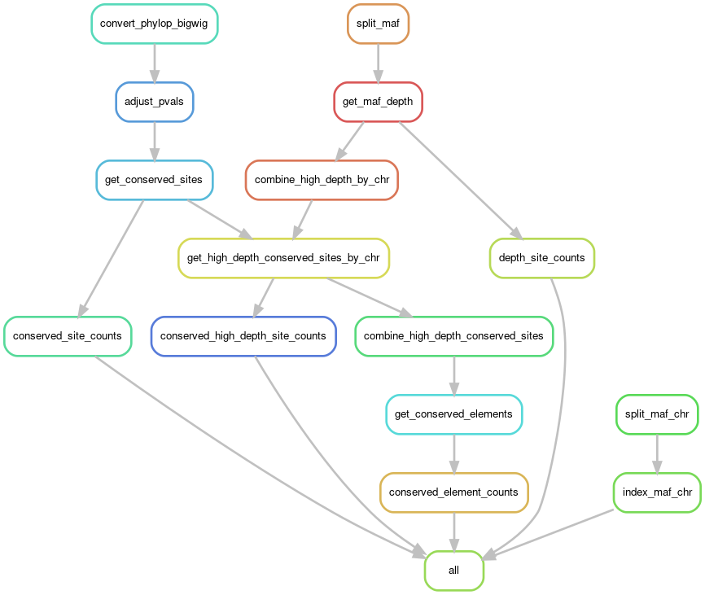

Predicting conserved elements based on regions with significant phyloP conservation scores and high alignment depth.

```{r setup, warning=FALSE, message=FALSE}

knitr::opts_chunk$set(echo = TRUE, warning = FALSE, message = FALSE)

library(tidyverse)
library(cowplot)
library(kableExtra)
library(viridis)
library(here)

source(here("docs", "lib", "design.r"))

```

# Workflow DAG

<center>

<p style="font-size:2em;">Currently only on element sizes of 200bp</p>
</center>


```{r read, warning=FALSE, message=FALSE}

chrome_file = here("summary-data", "GRCh38.chromes")
chrome_info = read_tsv(chrome_file, col_names=c("chr", "length", "location", "line.length", "line.length.nl")) %>%
  select(chr, length)
# Read the chrome info file and select juse the length and id cols

exclude_chr = c("chrX", "chrY")
# A vector of chromes to exclude from some plots

## Chromosome info
##########

conserved_sites_file = here("summary-data", "site-counts", "conserved", "241-mammalian-2020v2b.conserved-site-counts.0.05.tsv")
conserved_site_counts = read_delim(conserved_sites_file, delim=" ", col_names=c("chr", "num.conserved.sites")) %>%
  left_join(chrome_info, by="chr") %>%
  mutate(perc.conserved.sites = num.conserved.sites / length)
# Read the conserved site counts and merge with the chrome info and calculate percent per chrome

conserved_site_counts$chr = factor(conserved_site_counts$chr, levels=chrome_info$chr)
# Order the chromes for the plots

## Conserved site counts
##########

depth_dir = here("summary-data", "site-counts", "depth")

depth_counts = data.frame()
for(chrome in chrome_info$chr[!chrome_info$chr %in% exclude_chr]) {
  cur_depth_file = here(depth_dir, paste0("241-mammalian-2020v2b.", chrome, ".maf-depth-site-counts.tsv"))
  cur_depth_counts = read_delim(cur_depth_file, delim=" ", col_names=c("depth", "num.sites"))
  cur_depth_counts$chr = chrome
  
  depth_counts = rbind(depth_counts, cur_depth_counts)
}
# For each chromosome, read the depth site count file and add to the depth_counts df

depth_counts$chr = factor(depth_counts$chr, levels=chrome_info$chr) 
# Order the chromes for the plots

## Depth site counts
##########

depth_cutoffs = c(80,100,120,140)
# Specify the depth cut-offs to consider a site high-depth

conserved_hd_dir = here("summary-data", "site-counts", "conserved-high-depth")

conserved_hd_counts = data.frame()
for(chrome in chrome_info$chr[!chrome_info$chr %in% exclude_chr]) {
  for(depth_cutoff in depth_cutoffs) {
    cur_conserved_hd_file = here(conserved_hd_dir, depth_cutoff, paste0("241-mammalian-2020v2b.", chrome, ".conserved-high-depth-site-counts.0.05.", depth_cutoff, ".tsv"))
    cur_conserved_hd_counts = read_delim(cur_conserved_hd_file, delim=" ", col_names=c("sig.code", "num.sites"))
    cur_conserved_hd_counts$chr = chrome
    cur_conserved_hd_counts$depth.cutoff = depth_cutoff
    
    conserved_hd_counts = rbind(conserved_hd_counts, cur_conserved_hd_counts)
  }
}
# For each chromosome and depth cutoff, read the conserved, high depth site counts and add to the df

conserved_hd_counts$chr = factor(conserved_hd_counts$chr, levels=chrome_info$chr) 
# Order the chromosomes for the plots

## Conserved, high-depth sites
##########

chd_per_element_cutoffs = c(40, 60, 80, 100, 120, 140, 160, 180)
# The number of conserved, high-depth sites to consider a 200bp element conserved

element_dir = here("summary-data", "site-counts", "conserved-elements")

element_counts = data.frame()
for(depth_cutoff in depth_cutoffs) {
  for(chd_cutoff in chd_per_element_cutoffs) {
    cur_element_file = here(element_dir, depth_cutoff, paste0("241-mammalian-2020v2b.conserved-element-counts.0.05.", depth_cutoff, ".", chd_cutoff, ".tsv"))
    cur_element_counts = read_delim(cur_element_file, delim=" ", col_names=c("chr", "num.elements"))
    cur_element_counts$depth.cutoff = depth_cutoff
    cur_element_counts$chd.cutoff = chd_cutoff
    
    element_counts = rbind(element_counts, cur_element_counts)
  }
}
# For each depth and window cutoff, read the conserved elements and add to the df

element_counts$chr = factor(element_counts$chr, levels=chrome_info$chr)
# Order the chromosomes for the plots

## Conserved elements
##########

```

# Conserved sites

Corrected p-values for an FDR of 0.05

## Number of conservred sites per chromosome

```{r num-conserved-sites, warning=FALSE, message=FALSE}

num_conserved_p = ggplot(conserved_site_counts, aes(x=chr, y=num.conserved.sites)) +
  geom_segment(aes(x=chr, xend=chr, y=0, yend=num.conserved.sites), linetype="dotted", color="#666666") +
  geom_point(size=3, color="#920000") +
  geom_hline(yintercept=mean(conserved_site_counts$num.conserved.sites), linetype="dashed") +
  scale_y_continuous(limits=c(0, max(conserved_site_counts$num.conserved.sites)+150000), expand=c(0,0)) +
  xlab("Chromosome") +
  ylab("Number of conserved sites") +
  bartheme() +
  theme(axis.text.x = element_text(angle = 45, hjust = 1))
print(num_conserved_p)

```

Dashed line is mean.

```{r num-conserved-sites-summary, warning=FALSE, message=FALSE}

conserved_site_counts %>%
  summarize(mean.sites.chr=mean(num.conserved.sites), med.sites.chr=median(num.conserved.sites)) %>%
  kable() %>% kable_styling(bootstrap_options=c("striped", "condended", "responsive"), full_width=F)

```

## Percent of sites that are conserved per chromosome

```{r perc-conserved-sites, warning=FALSE, message=FALSE}

perc_conserved_p = ggplot(conserved_site_counts, aes(x=chr, y=perc.conserved.sites)) +
  geom_segment(aes(x=chr, xend=chr, y=0, yend=perc.conserved.sites), linetype="dotted", color="#666666") +
  geom_point(size=3, color="#db6d00") +
  geom_hline(yintercept=mean(conserved_site_counts$perc.conserved.sites), linetype="dashed") +
  scale_y_continuous(limits=c(0, max(conserved_site_counts$perc.conserved.sites)+0.005), expand=c(0,0)) +
  xlab("Chromosome") +
  ylab("Percent of sites that are conserved") +
  bartheme() +
  theme(axis.text.x = element_text(angle = 45, hjust = 1))
print(perc_conserved_p)

```

Dashed line is mean.

```{r perc-conserved-sites-summary, warning=FALSE, message=FALSE}

conserved_site_counts %>%
  summarize(mean.perc.sites.chr=mean(perc.conserved.sites), med.perc.sites.chr=median(perc.conserved.sites)) %>%
  kable() %>% kable_styling(bootstrap_options=c("striped", "condended", "responsive"), full_width=F)

```
# Alignment depth

Max depth is 241 (number of species in alignment)

```{r depth-dist, warning=FALSE, message=FALSE}

num_depth_p = ggplot(depth_counts, aes(x=depth, y=num.sites)) +
  geom_bar(stat="identity", fill=corecol(numcol=1, offset=1)) + 
  scale_y_continuous(expand=c(0,0)) +
  xlab("Alignment depth") +
  ylab("Number of sites") +
  bartheme()
print(num_depth_p)

```

```{r depth-dists-chr, warning=FALSE, message=FALSE, eval=F}

num_depth_chr_p = ggplot(depth_counts, aes(x=depth, y=num.sites)) +
  geom_bar(stat="identity") + 
  facet_wrap(~chr) +
  bartheme()
print(num_depth_chr_p)

```

# Conserved and high-depth sites

```{r conserved-hd-counts-chr, warning=FALSE, message=FALSE, out.width="75%", fig.height=6}

num_conserved_hd_chr_p = ggplot(conserved_hd_counts, aes(x=depth.cutoff, y=num.sites)) +
  geom_point() + 
  geom_line() +
  xlab("Cut-off to consider a site high-depth") +
  ylab("Number of conserved, high-depth sites") +
  facet_wrap(~chr, scales="free_y") +
  bartheme() +
  theme(axis.text = element_text(size = 8))
print(num_conserved_hd_chr_p)

```

# Conserved elements

```{r conserved-element-counts, warning=FALSE, message=FALSE}

num_conserved_elements_p = ggplot(element_counts, aes(x=depth.cutoff, y=chd.cutoff, fill=num.elements)) +
  geom_tile() + 
  scale_x_continuous(breaks=unique(element_counts$depth.cutoff)) +
  scale_y_continuous(breaks=unique(element_counts$chd.cutoff)) +
  xlab("Cut-off to consider a site high-depth") +
  ylab("Number of conserved, high-depth sites\nto consider an element conserved") +
  scale_fill_viridis(option="C") +
  #facet_wrap(~chr, scales="free_y") +
  bartheme()
print(num_conserved_elements_p)

```

```{r conserved-element-counts-table, warning=FALSE, message=FALSE, fig.height=8}

elements_total = element_counts %>% group_by(depth.cutoff, chd.cutoff) %>%
  summarize(num.elements=sum(num.elements))

elements_total %>% kable() %>% kable_styling(bootstrap_options=c("striped", "condended", "responsive"), full_width=F)

```